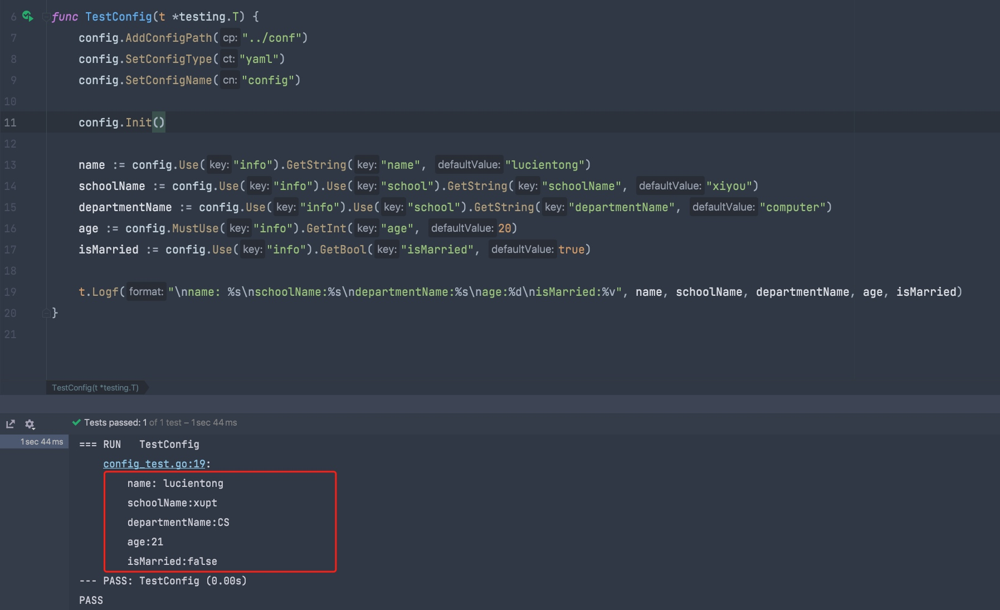

# C/S模式中间件

## 配置管理
基于[Viper](https://github.com/spf13/viper)实现，默认读取conf目录下的config.yaml文件。

- 如何设置配置文件？

```go
config.AddConfigPath("../conf")
config.SetConfigType("yaml")
config.SetConfigName("config")
```
使用 AddConfigPath 添加配置文件路径，框架会遍历查找。
使用 SetConfigType 设置配置文件类型，支持JSON, TOML, YAML, HCL, INI, envfile or Java properties
使用 SetConfigName 设置配置文件名称。

- example

config.yaml
```yaml
info:
#  name: "lucien"
  school:
    schoolName: "xupt"
    departmentName: "CS"
  age: 21
  isMarried: false

```
config_test.go
``` go
package test

import "testing"
import "cs/config"

func TestConfig(t *testing.T) {
	config.AddConfigPath("../conf")
	config.SetConfigType("yaml")
	config.SetConfigName("config")

	config.Init()

	name := config.Use("info").GetString("name", "lucientong")
	schoolName := config.Use("info").Use("school").GetString("schoolName", "xiyou")
	departmentName := config.Use("info").Use("school").GetString("departmentName", "computer")
	age := config.MustUse("info").GetInt("age", 20)
	isMarried := config.Use("info").GetBool("isMarried", true)

	t.Logf("\nname: %s\nschoolName:%s\ndepartmentName:%s\nage:%d\nisMarried:%v", name, schoolName, departmentName, age, isMarried)
}

```

输出：

